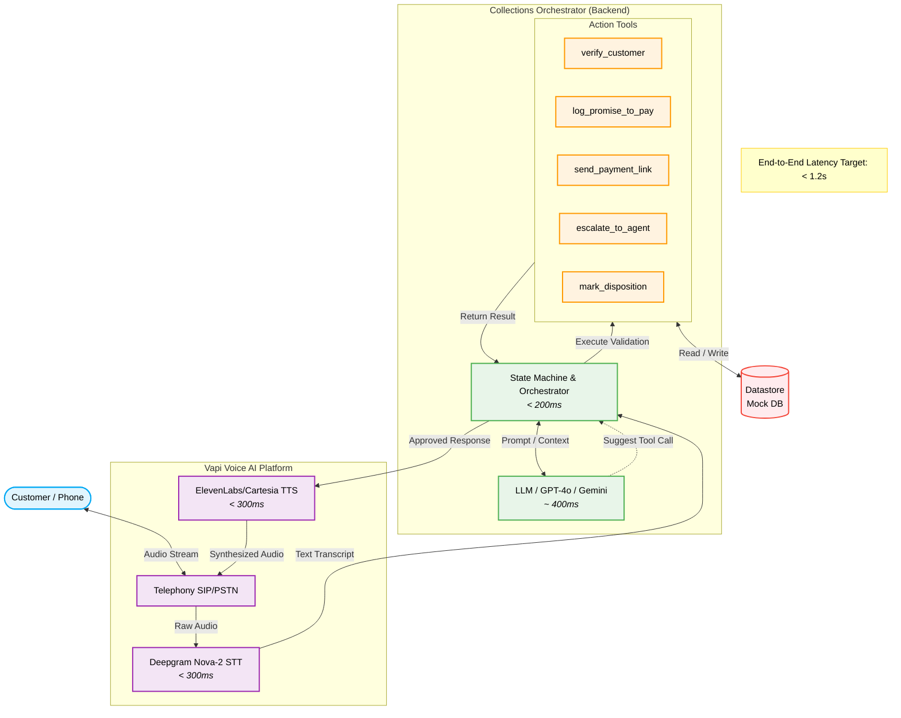

# Kapture Finance Collections Voicebot Architecture

```mermaid
flowchart TD
    %% Define styles
    classDef client fill:#e1f5fe,stroke:#03a9f4,stroke-width:2px,color:#000
    classDef platform fill:#f3e5f5,stroke:#9c27b0,stroke-width:2px,color:#000
    classDef core fill:#e8f5e9,stroke:#4caf50,stroke-width:2px,color:#000
    classDef external fill:#fff3e0,stroke:#ff9800,stroke-width:2px,color:#000
    classDef data fill:#ffebee,stroke:#f44336,stroke-width:2px,color:#000

    %% Participants
    Customer([Customer / Phone]):::client
    
    subgraph Vapi ["Vapi Voice AI Platform"]
        Telephony[Telephony SIP/PSTN]:::platform
        STT[Deepgram Nova-2 STT<br/><i>< 300ms</i>]:::platform
        TTS[ElevenLabs/Cartesia TTS<br/><i>< 300ms</i>]:::platform
    end

    subgraph Backend ["Collections Orchestrator (Backend)"]
        StateMgr[State Machine & Orchestrator<br/><i>< 200ms</i>]:::core
        LLM[LLM / GPT-4o / Gemini<br/><i>~ 400ms</i>]:::core
        
        subgraph Tools ["Action Tools"]
            Verify[verify_customer]:::external
            PTP[log_promise_to_pay]:::external
            PayLink[send_payment_link]:::external
            Escalate[escalate_to_agent]:::external
            Dispo[mark_disposition]:::external
        end
    end

    Database[(Datastore<br/>Mock DB)]:::data

    %% Workflow Connections
    Customer <--> |Audio Stream| Telephony
    Telephony --> |Raw Audio| STT
    STT --> |Text Transcript| StateMgr
    
    StateMgr <--> |Prompt / Context| LLM
    LLM -.-> |Suggest Tool Call| StateMgr
    
    StateMgr --> |Execute Validation| Tools
    Tools <--> |Read / Write| Database
    Tools --> |Return Result| StateMgr
    
    StateMgr --> |Approved Response| TTS
    TTS --> |Synthesized Audio| Telephony

    %% Latency Notes
    note1[End-to-End Latency Target: < 1.2s]
    style note1 fill:#ffffcc,stroke:#ffcc00,stroke-width:1px,color:#000
```
